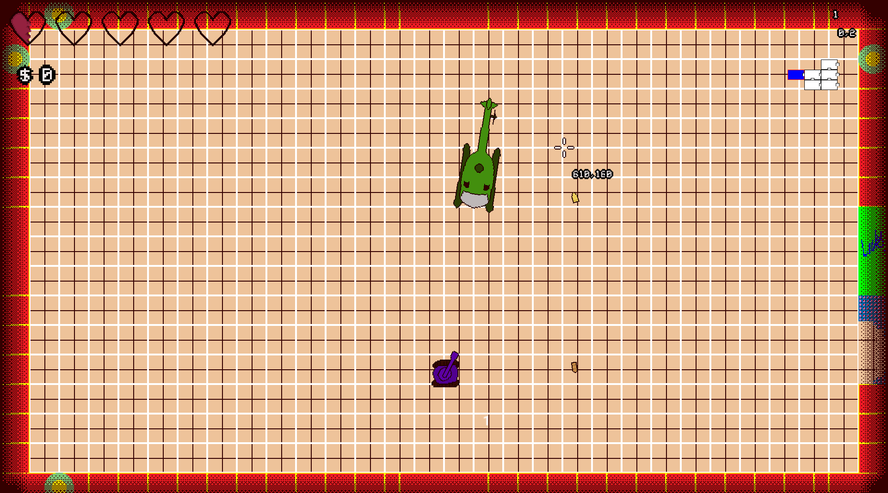
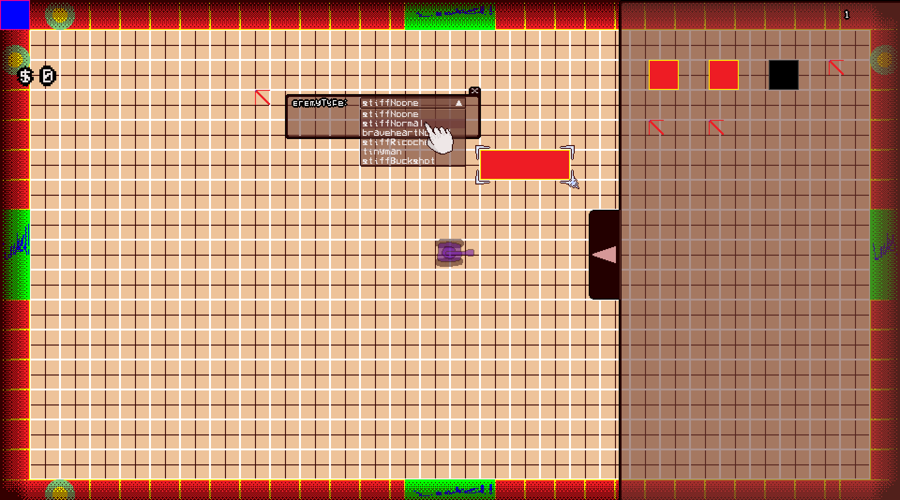

# We Love Tanks

We Love Tanks is meant to be a roguelike[^1] action game inspired by *Wii Play*'s *Wii Tanks* and popular Roguelikes like *Enter the Gungeon* and *The Binding of Isaac*. It will feature several stages, each with different enemies and bosses, and as you play, you find different items that improve your characters abilities or alter the way you play the game (usually) for the better. 

The game is intended to be simply a side-project and meant to be a fun tool to sharpen my development skills.
[^1]:Roguelike, or rougelite, is a genre of games that commonly feature permadeath (necessitating restarting the game upon death) and procedurally generated levels.
---

## Features
- Procedurally generated dungeons
- Built-in room editor
- Boss encounters (sort of!)
- Items with gameplay effects

---

## Built with GameMaker Studio 2
- Currently requires GMS 2 to run the project

---

## Screenshots

*Boss fight*

*Room editor*

Please note that I haven't done much in terms of graphics yet 😿

